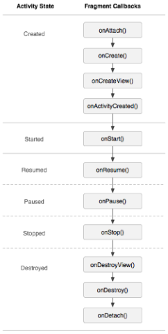
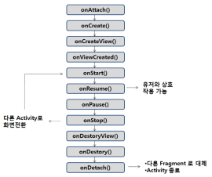
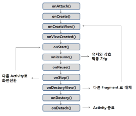

# 17장 Support 라이브러리 활용
## 목록
[17.1.](#171-fragment) Fragment
  - [17.1.1.](#1711-fragment-이해) Fragment 이해
  - [17.1.2.](#1712-fragment-작성법) Fragment 작성법
  - [17.1.3.](#1713-fragment-생명주기) Fragment 생명주기
  - [17.1.4.](#1714-다양한-fragment) 다양한 Fragment

[17.2.](#172-preferencefragmentcompat을-이용한-앱-설정) PreferenceFragmentCompat을 이용한 앱 설정
  - [17.2.1.](#1721-preferencescreen) PreferenceScreen
  - [17.2.2.](#1722-preferencefragmentcompat) PreferenceFragmentCompat

[17.3.](#173-viewpager) ViewPager

[17.4.](#174-recyclerview) RecyclerView
  - [17.4.1.](#1741-recyclerview-소개) RecyclerView 소개
  - [17.4.2.](#1742-adapter-viewholder) Adapter, ViewHolder
  - [17.4.3.](#1743-layoutmanager) LayoutManager

## 17.1. Fragment
### 17.1.1. Fragment 이해
- 액티비티처럼 이용할 수 있는 뷰
- API Level 11에서 추가된 뷰이며 표준 라이브러리에서 제공
- Support 라이브러리에서도 같은 클래스명으로 제공
- API 하위 호환성 문제, `Fragment`와 함께 이용되는 `ViewPager` 등이 Support 라이브러리의 클래스라는 점 등의 이유로 Support 라이브러리에서 제공하는 `Fragment`를 주로 사용함
- 넓은 화면을 가진 태블릿PC의 액티비티 개발 생산성과 유지보수를 위해 등장
- 뷰 클래스를 추상화하여 코드를 간결하게 만드는 것은 뷰의 생명주기가 액티비티의 생명주기와 달라서 불가능
- `Fragment`는 뷰이지만 액티비티의 생명주기를 그대로 따르도록 개발됨
- 화면과 업무 로직 등을 `Fragment` 클래스로 추상화화여 작성하고 액티비티에서는 `Fragment`를 다른 뷰처럼 화면에 출력하는 구조

### 17.1.2. Fragment 작성법
- `Fragment`의 화면을 위한 레이아웃 XML 파일 작성
  - 액티비티 레이아웃 구성과 차이가 없음
- `Fragment` 클래스에서 XML 파일로 화면 구성
  ```Java
  public class OneFragment extends Fragment {
    public View onCreateView(LayoutInflater inflater, ViewGroup container, Bundle savedInstanceState) {
      return inflater.inflate(R.layout.fragment_one, container, false);
    }
  }
  ```
  - `onCreateView()`내에서 `LayoutInflater`로 초기화되어 반환된 뷰가 Fragment의 화면이 됨
- 액티비티에서 `Fragment` 출력 - XML 파일로 출력
  ```xml
  <fragment
    android:id="@+id/fragment_one"
    android:layout_width="match_parent"
    android:layout_hegiht="wrap_content"
    class="com.example.test6_17.OneFragment" />
  ```
  - 다른 뷰처럼 `Fragment`를 사용하고 `class`속성에 `Fragment` 클래스를 지정
- 액티비티에서 `Fragment` 출력 - Java 코드로 출력
  ```xml
  <LinearLayout
    android:id="@+id/main_container"
    android:layout_width="match_parent"
    android:layout_hegiht="match_parent"
    android:orientation="vertical">
  </LinearLayout>
  ```
  - XML 파일에 `Fragment`가 나올 위치 생성
  ```Java
  FragmentManager manager = getSupportFragmentManager();
  OneFragment oneFragment = new OneFragment();

  FragmentTransaction ft = manager.beginTransaction();
  ft.add(R.id.main_container, oneFragment);
  ft.commit();
  ```
  - `FragmentManager` 클래스로 `FragmentTransaction`클래스를 획득하여 `Fragment`를 `add()`메소드로 지정한 위치에 추가
  - `add(int containerViewId, Fragment mfragment)`: `mfragment`를 `containerViewId` 영역에 추가
  - `replace(int containerViewId, Fragment mfragment)`: `containerViewId` 영역의 `Fragment`를 `mfragment`로 대체
  - `remove(Fragment mfragment)`: `mfragment` 제거
  - `commit()`: 화면 적용

### 17.1.3. Fragment 생명주기

- 액티비티의 생명구조와 동일하며 `Fragment`만을 위한 생명주기 함수가 더 추가된 구조
  - `onAttach(Activity activity)`: `Fragment`가 액티비티에 포함되는 순간 호출됨
  - `onCreateView(LayoutInflater inflater, ViewGroup container, Bundle savedInstanceState)`: `Fragment`의 UI 구성을 위해 호출됨
  - `onActivityCreated(Bundle savedInstanceState)`: `Fragment`가 포함된 액티비티의 `onCreate()` 메소드가 반환될 때 호출됨
  - `onDestroyView()`: `Fragment`가 화면에서 사라지고 `BackStack`에 추가된 후 호출됨
  - `onDetach()`: `Fragment`가 액티비티에서 제거될 때 호출됨
- `BackStack`을 이용할 때와 이용하지 않을 때 `Fragment`의 생명주기는 다르게 적용됨

  | BackStack 미사용 | BackStack 사용 |
  |:---:| :---:|
  |||
    - `BackStack`: `Fragment`가 화면에 안보이게 되더라도 제거하지 않고 저장했다가 다시 이용할 수 있게 하는 기능
    - `BackStack`을 사용하는 경우 `Fragment`가 다른 `Fragment`로 대체 되었을 때 사용자가 뒤로가기 버튼을 눌러 다시 되돌아 오거나 다시 사용되면 `onCreateView()` 함수부터 다시 호출됨
    - `ft.addToBackStack(null)`: `Fragment`를 `BackStack`에 추가

### 17.1.4. 다양한 Fragment
#### ListFragment
- `ListView`로 화면을 구성할 때 `ListView`와 관련된 내용만 액티비티에서 분리해서 `Fragment`로 구현할 수 있게 만든 클래스
- `Fragment`를 위한 별도의 `ListView`를 준비할 필요가 없음
  ```Java
  public class OneFragment extends ListFragment {
    @Override
    public void onViewCreated(View view, Bundle savedInstanceState) {
      super.onViewCreated(view, savedInstanceState);
      String[] datas = {"박찬호", "류현진", "김현수", "오승환"};
      ArrayAdapter<String> aa = new ArrayAdapter<String>(getActivity(), android.R.layout.simple_list_item_1, datas);
      setListAdapter(aa);
    }
  }
  ```
  - `ListView`를 위한 `Adapter`를 준비한 후 `setAdapter`를 이용하여 적용
  - `ListFragment`클래스에 내장된 `ListView`를 이용하기 때문에 `Fragment`를 위한 레이아웃 XML 파일을 `Inflate`하지 않아도 됨
  ```Java
  @Override
  public void onListItemClick(ListView l, view v, int position, long id) {
    super.onListItemClick(l, v, position, id);
  }
  ```
  - 항목 이벤트 처리
#### DialogFragment
```Java
public class ThreeFragment extends DialogFragment {
  @Override
  public Dialog onCreateDialog(Bundle savedInstanceState) {
    AlertDialog.Builder builder = new AlertDialog.Builder(getActivity());
    builder.setTitle("DialogFragment");
    builder.setMessage("DialogFragment 내용이 잘 보이지요?");
    builder.setPositiveButton("OK", null);
    AlertDialog dialog = builder.create();
    return dialog;
  }
}
```
- `onCreateDialog()` 메소드에서 반환한 `dialog` 객체가 화면에 뜨게 됨
- `Dialog`이기 때문에 `FragmentTransaction`에 의해 액티비티에 추가되는 대신 `DialogFragment` 클래스의 `show()` 메소드를 통해 출력됨
  ```Java
  FragmentManager manager = getSupportFragmentManager();
  ThreeFragment threeFragment = new ThreeFragment();
  threeFragment.show(manager, null);
  ```

## 17.2. PreferenceFragmentCompat을 이용한 앱 설정
### 17.2.1. PreferenceScreen
- 앱의 환경설정을 위해서는 액티비티에서 설정 화면을 구성하고, 그 화면에서 발생하는 다양한 사용자 이벤트를 처리한 뒤 설정 데이터를 영속적으로 저장해야 함
- `PreferenceFragmentCompat` 클래스는 앱의 환경설정 화면 UI 구성에 도움을 줌
- 설정 화면을 위한 XML 파일은 레이아웃 XML 파일이 아니며, 따라서  `../res/xml`에 저장 됨

#### \<CheckBoxPreference\>, \<SwitchPreference\>
```xml
<CheckBoxPreference
  android:key="message"
  android:title="소리 알림"
  android:summary="소리로 알림을 앋으려면 체크하세요"/>

<SwitchPreference
  android:key="vibrate"
  android:title="진동 알림"
  android:sumary="진동 울림으로 알림을 받으려면 체크하세요"/>
```
- 사용자에게 간단하게 `true / false` 값인 설정 데이터를 받는 태그
- `true / false` 값이 바뀌면 `<key>` 속성에 지정된 값을 `key`로 하여 `SharedPreferences` 객체에 자동으로 저장됨

#### \<EditTextPreference\>  
```xml
<EditTextPreference
  android:key="nickname"
  android:title="Nickname"
  android:summary="Nickname을 설정하세요"
  android:dialogTitle="Nickname 설정" />
```
- 사용자에게 간단한 글을 입력받아 설정 데이터를 받는 태그
- 글을 입력받을 때 자동으로 `Dialog`를 띄움
- 입력받은 글은 자동 저장됨

#### \<ListPreference\>, \<MultiSelectListPreference\>
```xml
<ListPreference
  android:key="sound"
  android:title="알림음"
  android:summary="카톡"
  android:entries="@array/array_voice"
  android:entryValues="@array/array_voice" />
```
- 사용자에게 목록을 띄우고 아이템을 선택받는 태그
- 목록 선택을 위해 자동으로 `Dialog`를 띄움
- `<entries>`: 목록을 구성할 문자열 데이터
- `<entryValues>`: 선택한 항목에 따라 저장되어야 하는 값
- `<entries>`와 `<entryValues>`는 배열 리소스를 이용해야 함

#### \<RingtonePreference\>
```xml
<RingtonePreference
  android:title="Choose Alarm"
  android:key="ringtone"
  android:summary="ringtone" />
```
- 스마트폰에 기본으로 등록된 알람음 목록을 `<ListPreference>`처럼 단일 선택 목록 화면으로 보여줌

#### \<PreferenceCategory\>
```java
<PreferenceCategory android:title="디버깅">

  <SwitchPreference
    android:defaultValue="false"
    android:key="debugging"
    android:summary="USB가 연결된 경우 디버그 모드 사용"
    android:title="USB 디버깅" />

  <CheckBoxPreference
    android:defaultValue="false"
    android:dependecy="debugging"
    android:key="usb_app"
    android:summary="ADB/ADT을 통해 설치된 앱의 유해한 동작이 있는지 확인"
    android:title="USB를 통해 설치된 앱 학인" />

</PreferenceCategory>
```
- 화면에 나오는 설정 여러 개를 묶어서 표현하기 위한 태그
- 일종의 서브 타이틀 정도의 개념
- `<dependecy>`: `Preference`의 결합 관계를 표현
  - 연결한 `Preference`가 `true`이면 활성화, `false`이면 비활성화
  - 속성 값은 `Preference key`값

#### \<PreferenceScreen\>
```xml
<PreferenceScreen android:title="이동통신망">

  <SwitchPreference
    android:defaultValue="false"
    android:key="roaming"
    android:summary="로밍 시 데이터 서비스에 연결"
    android:title="데이터 로밍" />

  <SwitchPreference
    android:key="lte_mode"
    android:summary="LTE 서비스를 사용하여 음성 및 기타 통신을 개선할 수 있습니다.(권장)"
    android:title="향상된 4G LTE 모드" />

</preferencescreen>
```
- XML 파일의 루트 태그
- `<PreferenceScreen>`태그가 중첩되어 있다면 중첩된 설정 화면은 별도의 화면으로 나옴
```xml
<PreferenceScreen
  android:title="네트워크 운영자"
  android:summary="네트워크 운영자 선택">
  <intent
    android:targetPackage="com.example.test6_17"
    android:targerClass="com.examp;e/test6_17/SettingsSubActivity"/>
</PreferenceScreen>
```
- 설정의 서브 화면을 전혀 다른 액티비티로 구현해야 할 경우 `<intent>` 태그를 사용

### 17.2.2. PreferenceFragmentCompat
- `PreferenceFragmentCompat`은 Support 라이브러리에서 제공하는 클래스이기 때문에 `dependecy` 설정이 필요함
  ```java
  // build.gradle(app)
  dependecies {
    //...
    implementation 'com.android.support:preference-v14:28.0.0'
  }
  ```
- 설정 XML 파일 적용
  ```Java
  public class SettingPreferenceFragment extends PreferenceFragmentCompat {
    @Override
    public void onCreatePreferences(Bundle bundle, String s) {
      setPreferencesFromResource(R.xml.settings_preference, s);
    }
  }
  ```
- 설정 화면 출력
  ```xml
  <fragment xmlns:android="http://schemas.android.com/apk/res/android"
    android:id="@+id/settings_fragment"
    android:name="com.example.test6_17.SettingPreferenceFragment"
    android:layout_width="match_parent"
    android:layout_hegiht="match_parent" />
  ```
  - `<name>`: 전체 패키지명

#### summary 변경
```java
SharedPreferences prefs = PreferenceManager.getDefaultSharedPreferences(getActivity());
if(!prefs.getString("sound", "").equals("")) {
  soundPreference.setSummary(prefs.getString("sound", "카톡"));
}
```
- `SharedPreferences`를 이용하여 summary 변경

#### Preference 이벤트 처리
- 리스너 등록
  ```java
  prefs.registerOnSharedPreferenceChangeListener(prefListener);
  ```
- 리스너
  ```java
  SharedPreferences.OnSharedPreferenceChangeListener prefListener =
          new SharedPreferences.OnSharedPreferenceChangeListener() {

    @Override
    public void onSharedPreferenceChanged(SharedPreferences sharedPreferences, String key) {
      if(key.equals("sound")) {
        soundPreference.setSummary(pref.getString("sound", "카톡"));
      }
    }
  }
  ```

## 17.3. ViewPager
- Swipe 화면을 개발하기 위한 클래스
- 레이아웃 XML 파일에 등록
  ```xml
  <androidx.viewpager.widget.ViewPager
    android:id="@+id/pager"
    android:layout_width="match_parent"
    android:layout_hegiht="match_parent" />
  ```
- `AdapterView`의 한 종류이기 때문에 `Adapter`가 필요함
- `ViewPager`를 위한 `Adapter`로는 기본 `PagerAdapter`와 화면을 `Fragment`로 개발하기 위한 `FragmentPagerAdapter` 두가지가 제공됨
- `PagerAdapter`
  ```Java
  class MyPagerAdapter extends PagerAdapter {
    @Override
    public int getCount() {
      //...
    }
    @Override
    public boolean isViewFromObject(View arg0, Object arg1) {
      //...
    }
    @Override
    public Object instantiateItem(ViewGroup container, int position) {
      if(position == 0) {
        TextView tv = new TextView(Lab2Activity.this);
        //...
        container.addView(tv, position);
        return tv;
      }
      //...
      return null;
    }
    @Override
    public void destroyItem(ViewGroup container, int position, Object object) {
      container.removeView((View) object);
    }
  }
  ```
  - `getCount()`
    - 항목(화면) 개수 결정
  - `instantiateItem(ViewGroup container, int position)`
    - 화면을 구성하는 메소드
    - `position`: 화면을 구분하기 위한 값
    - 하나의 `position`에 여러 뷰를 추가 할 수 있음
  - `isViewFromObject(View arg0, Object arg1)`
    - 화면 구성을 위한 뷰 결정
    - `instantiateItem()` 메소드에서 결정한 뷰를 바로 화면에 출력하지 않는 이유는 화면 구성이 상황에 따라 다르게 나올 수 있고 그 알고리즘을 구현하기 위함
    - `instantiateItem()` 메소드에서 추가했던 뷰 객체와 반환했던 `Object` 객체가 여기에 전달됨
    - 이 메소드가 `true`를 반환하면 매개변수 속 뷰 객체를 화면에 출력함
  - `destroyItem(ViewGroup container, int position, Object object)`
    - 뷰 소멸을 위한 메소드
- `FragmentPagerAdapter`
  ```java
  class MyPagerAdapter extends FragmentPagerAdapter {
    ArrayList<Fragment> fragments;
    public MyPagerAdapter(FragmentManager manager) {
      super(manager);
      //...
    }
    @Override
    public int getCount() {
      //...
    }
    @Override
    public Fragment getItem(int position) {
      //...
    }
  }
  ```
  - 일반적으로 `ViewPager`의 각 화면을 `Fragment`로 만들기 때문에 `FragmentPagerAdapter`를 더 많이 사용함
  - `super(manager)`: 상위 클래스의 생성자가 내부적으로 `FragmentTransaction`을 진행하기 때문에 개발자가 `add`, `replace`, `remove` 작업을 하지 않아도 됨
- `ViewPagerAdapter` 적용
  ```java
  MyPagerAdapter pagerAdapter = new MyPagerAdapter(getSupportFragmentManager());
  pager.setAdapter(pagerAdapter);
  ```

## 17.4. RecyclerView
### 17.4.1. RecyclerView 소개
- 목록 화면을 구성하기 위한 뷰
- `support:recyclerView-v7` 라이브러리로 제공된 클래스이므로 `dependecy`를 명시해야 함
  ```java
  // gradle(app)
  implementation 'com.android.support:recyclerview-v7:28.0.0'
  // in androidx
  implementation "androidx.recyclerview:recyclerview:1.1.0"
  ```
- `ListView`의 더 진보하고 유연해진 버전
- `ListView`와 달리 `Adapter` 이외에도 `LayoutManager`, `ViewHolder`, `ItemDecoration`, `ItemAnimation` 등을 활용하여 목록 화면을 구성
  - `Adapter`: `RecyclerView`의 항목 구성 담당
  - `ViewHolder`: 각 항목을 구성하는 뷰의 재활용을 목적으로 Holder의 역할을 함
  - `LayoutManager`: 항목의 배치를 담당
  - `ItemDecoration`: 항목 꾸미기 담당
  - `ItemAnimation`: 아이템이 추가, 제거, 정렬될 때의 애니메이션 처리를 담당
  - `Adapter`, `ViewHolder`, `LayoutManager`는 `RecyclerView`의 필수 구성 요소임

### 17.4.2. Adapter, ViewHolder
- 액티비티의 레이아웃 XML 파일에 `RecyclerView`를 배치
  ```XML
  <android.support.v7.widget.RecyclerView/>
  <!-- in androidx -->
  <androidx.recyclerview.widget.RecyclerView/>
  ```
- `ViewHolder` 클래스 정의
  ``` java
  private class MyViewHolder extends RecyclerView.ViewHolder {
    public TextView title;
    public MyViewHolder(View itemView) {
      super(itemView);
      title = itemView.findViewById(android.R.id.text1);
    }
  }
  ```
  - `ViewHolder`는 항목을 구성하기 위한 뷰들을 `findViewById` 해주는 역할
  - `RecyclerView`는 `Adapter`에 `ViewHolder` 적용이 강제됨
    - `Adapter` 내부에서 `ViewHolder` 객체를 메모리에 유지해줌으로써 `ViewHolder`에 의해 최초 한 번만 `findViewById`하기 위함
    - `findViewById`에 의한 성능 이슈를 해결
- `Adapter` 클래스 정의
  ```java
  private class MyAdapter extends RecyclerView.Adapter<MyViewHolder> {
    private List<String> list;  // 항목을 구성할 데이터

    public MyAdapter(List<String> lsit) {
      this.list = list;
    }

    /*
      항목을 구성하기 위한 레이아웃 xml파일 inflate
      리턴값: inflate된 View의 계층 구조에서 View를 findViewById할 ViewHolder 리턴
      리턴된 값은 내부적으로 메모리에 유지했다가 onBindViewHolder 메소드 호출 시
      매개변수로 전달됨
    */
    @Override
    public MyViewHolder onCreateViewHolder(ViewGroup viewGroup, int i) {
      View view = LayourInflater.from(viewGroup.getContext())
              .inflate(android.R.layout.simple_list_item_1, viewGroup, false);
      return new MyViewHolder(view);
    }

    /*
      각 항목을 구성하기 위해 호출되는 메소드
    */
    @Override
    public void onBindViewHolder(MyViewHolder viewHolder, int position) {
      String text = list.get(position);
      viweHolder.title.setText(text);
    }

    /*
      항목의 개수
    */
    @Override
    public int getItemCount() {
      retrun list.size();
    }
  }
  ```
- `Adapter`를 `RecyclerView`에 적용
  ```Java
  recyclerView.setLayoutManager(new LinearLayoutManager(this));
  recyclerView.setAdapter(new MyAdapter(list));
  ```

### 17.4.3. LayoutManager
- `RecyclerView`의 각 항목을 어떻게 배치할 것인가를 결정하는 역할
- `LinearLayoutManager`
  ```Java
  LinearLayoutManager linearLayoutManager = new LinearLayoutManager(this);
  linearLayoutManager.setOrientation(LinearLayoutManager.HORIZONTAL);
  recyclerView.setLayoutManager(linearLayoutManager);
  ```
  - 항목을 수평 또는 수직으로 배치
  - 기본값은 수직 방향
- `GridLayoutManager`
  ```java
  GridLayoutManager gridLayoutManager = new GridLayoutManager(this, 2);
  recyclerView.setLayoutManager(gridLayoutManager);
  ```
  - 항목을 그리드로 배치
  - 생성자의 두번째 매개변수는 열의 개수
  ```java
  GridLayoutManager gridLayoutManager = new GridLayoutManager(this, 2, GridLayoutManager.HORIZONTAL, false);
  ```
  - 수평 방향으로 증가하는 그리드 배치
  - 마지막 매개변수는 항목을 아래(수평 방향이면 오른쪽)에서부터 배치할지를 정함
- `StaggeredGridLayoutManager`
  ```Java
  StaggeredGridLayoutManager sgManager = new StaggeredGridLayoutManager(2, StaggeredGridLayoutManager.VERTICAL);
  ```
  - `GridLayoutManager`를 변형한 버전
  - 생성자의 첫번째 매개변수는 열의 개수
  - 기본적으로 그리드 구조로 나열되지만 한 항목이 길때는 그옆에 여러 항목이 배치될 수 있음
