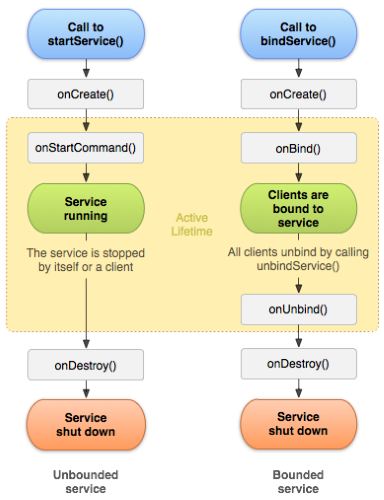

# 20장 서비스 컴포넌트
## 목록
[20.1.](#201-서비스-기본-개념) 서비스 기본 개념
  - [20.1.1](#2011-서비스-작성-방법) 서비스 작성 방법
  - [20.1.2.](#2012-서비스-생명주기) 서비스 생명주기
  - [20.1.3.](#2013-데이터-공유) 데이터 공유

[20.2.](#202-aidl의-이해) AIDL의 이해
  - [20.2.1.](#2021-aidl-프로그램-구조) AIDL 프로그램 구조
  - [20.2.2.](#2022-aidl-작성-방법) AIDL 작성 방법

[20.3.](#203-인텐트-서비스intentservice) 인텐트 서비스(IntentService)

[20.4.](#204-시스템-서비스systemservice) 시스템 서비스(SystemService)
  - [20.4.1.](#2041-activitymanager) ActivityManager
  - [20.4.2.](#2042-packagemanager) PackageManager

[20.5.](#205-백그라운드-서비스-제한) 백그라운드 서비스 제한

## 20.1. 서비스 기본 개념
백그라운드 작업을 위한 컴포넌트로 MP3, 채팅 등에 이용

### 20.1.1. 서비스 작성 방법
- `Service` 클래스 상속받아 작성
  ```java
  public class PlayService extends Service {
    //...
  }
  ```
- `AndroidManifest`에 컴포넌트 등록
  ```xml
  <service android:name=".PlayService"></service>
  ```
  - 암시적 인텐트로 수행되게 하기 위해서는 내부에 `<intent-filter>`를 설정해야 함
- 서비스 실행
  ```java
  Intent intent = new Intent(this, PlayService.class);
  startService(intent);
  ```
  - `Extra` 데이터 전달 가능
- 서비스 종료
  ```java
  Intent intent = new Intent(this, PlayService.class);
  stopService(intent)
  ```
- `bindService()` & `unbindService()` 메소드
  - 서비스를 실행하고 종료하기 위한 또다른 메소드
  - `ServiceConnection` 인터페이스를 구현한 객체가 필요
    ```java
    ServiceConnection connection = new ServiceConnection() {
      @Override
      public void onServiceConnected(ComponentName name, IBinder service) {
        // bindService() 메소드로 인해 서비스가 구동하는 시점에 호출되는 메소드
      }

      @Override
      public void onServiceDisconnected(ComponentName name) {
        // unbindService() 메소드로 인해 서비스가 종료된 시점에 호출되는 메소드
      }
    };
    ```
  - 서비스 실행
    ```java
    Intent bIntent = new Intent(this, bindService.class);
    bindService(bIntent, connection, Context.BIND_AUTO_CREATE);
    // BIND_AUTO_CREATE: flag - 바인딩이 존재하는 한 서비스 자동으로 생성
    ```
  - 서비스 종료
    ```java
    unbindService(connection);
    ```

### 20.1.2. 서비스 생명주기

- 서비스는 `Singleton`으로 동작하는 컴포넌트
  > Singleton Pattern: 최초 한번만 메모리를 할당하고 그 메모리에 인스턴스를 만들어 사용하는 디자인패턴. 생성자가 여러 차례 호출되더라도 최초 생성 이후에 호출된 생성자는 최초에 생성한 객체를 반환함

- `Running` 상태인 서비스를 `startService()` 혹은 `bindService()` 메소드로 다시 실행하면 서비스 객체는 다시 생성되지 않고 `onStartCommand()` 혹은 `onBind()` 메소드부터 다시 호출됨
- `onBind()` 메소드는 반환값이 존재
  ```java
  @Override
  public IBinder onBind(Intent intent) {
    return new MyBinder();
  }

  class MyBinder extends Binder {
    public void some() {
      //...
    }
  }
  ```
  - `onBind()`가 반환할 객체는 `Binder`를 상속받아 개발자가 만든 클래스의 객체
  - `onBind()`가 반환한 객체는 `ServiceConnection` 구현 객체의 `onServiceConnected()` 메소드의 매개변수로 전달됨
- `bindService()`로 실행된 서비스는 자신에게 바인드된 컴포넌트가 하나도 없으면 자동으로 종료됨
  - 서비스를 실행한 액티비티의 종료 혹은 `unbindService()`의 호출
  - 여러 액티비티가 `bindService()`로 서비스를 이용하고 있다면 하나의 액티비티가 종료되거나 `unbindService()`를 호출해도 종료되지 않음

### 20.1.3. 데이터 공유
- 서비스에서 데이터가 발생한 순간 다른 컴포넌트에 전달해야 하는 상황 존재
- 인텐트의 Extra 데이터로는 액티비티나 서비스를 최초에 시작할 때만 데이터 전달 가능
#### startService()로 서비스를 실행한 경우
- 서비스를 `startService()`로 실행하면 특정 객체가 반환되지 않고 액티비티와 서비스가 독립적으로 실행되기 때문에 데이터를 직접적으로 전달할 수 없음
- 브로드캐스트 리시버를 이용하여 간접적으로 전달
  - 서비스나 액티비티 내부에 브로드캐스트 리시버를 정의
  - 데이터 전달이 필요할 때 브로드캐스트 인텐트에 Extra 데이터로 전달
    ```java
    Intent intent = new Intent("com.example.PLAY_TO_SERVICE");
    intent.putExtra("mode", "stop");
    sendBroadcast(intent);
    ```
  - 브로드캐스트 리시버에서 인텐트 속 데이터 추출
    ```java
    @Override
    public void onReceive(Context context, Intent intent) {
      String mode = intent.getStringExtra("mode");
    }
    ```
#### bindService()로 서비스를 실행한 경우
- 서비스를 `bindService()`로 실행하면 `onBind()`에서 반환한 객체가 액티비티에 바인딩됨
- 바인딩된 객체의 함수를 호출하여 함수의 매개변수와 반환값으로 데이터를 주고 받음

## 20.2. AIDL의 이해
- AIDL(Android Interface Definition Language): 안드로이드에서 프로세스 간의 통신을 지칭하는 용어
- 두 앱의 프로세스가 실행된 상태에서 발생하는 데이터를 프로세스 간의 통신을 통해 주고받기 위한 기술
### 20.2.1. AIDL 프로그램 구조
- 개발자가 직접 코드를 작성하지 않고 외부 앱의 함수 호출만으로 프로세스 간 통신
- `Java`의 `RMI`와 유사
  > RMI: Remote Method Invocation의 약자로 Java에서 네트워크상으로 떨어져 있는 두 애플리케이션 간의 데이터 통신에 사용됨

- `bindService()` 함수로 서비스를 실행하여 객체를 공유하고, 공유된 객체의 함수를 호출하면서 프로세스 간의 통신을 수행
- AIDL 프로그램 구조
  - 서비스를 요청하는 프로세스를 클라이언트로, 이 요청으로 인해 업무가 진행되는 곳을 서버로 지칭
  1. 서버에서 확장자가 `aidl`인 파일 준비
      > aidl: 자바의 인터페이스처럼 함수만 선언한 파일로 이 함수를 클라이언트에서 호출하게 됨

  2. `aidl`의 함수들을 구현한 객체를 서버에서 서비스로 준비
  3. `aidl` 파일을 클라이언트에도 공유
  4. 클라이언트에서 `bindService()`로 서버 쪽 서비스를 실행
  5. `onBind()`에서 `aidl` 통신을 대행해주는 `Stub` 클래스를 자동으로 만들어 결과값을 클라이언트 쪽에 반환
  6. 클라이언트에서 반환받은 바인드 객체의 함수를 호출하면 이 호출이 서버로 넘어가서 서버의 함수가 실행됨
  7. 함수의 매개변수 혹은 반환값으로 데이터를 주고받을 수 있음

### 20.2.2. AIDL 작성 방법
- `aidl` 파일 작성
  ```java
  interface IPlayService {
    void start();
    void stop();
  }
  ```
- 서비스 작성
  ```java
  @Override
  public IBinder onBind(Intent intent) {

    return new IPlayService.Stub() {
      @Override
      public void start() throws RemoteException {
        //...
      }
      @Overrdie
      public void stop() throws RemoteException {
        //...
      }
    };
  }
  ```
  - 반환된 객체는 실제 업무 로직을 가지는 객체가 아니라, 프로세스 간의 통신을 대행할 `Stub` 객체가 자동으로 만들어져서 반환됨
- `bindService()`에 의해 서비스 실행
  ```java
  Intent intent = new Intent("com.example.ACTION_PLAY");
  intent.setPackage("com.example.test7_20_aidl");
  bindService(intent, connection, Context.BIND_AUTO_CREATE);
  ```
  - 대상이 되는 앱의 패키지명을 `setPackage()`로 설정해야 함
- 바인드 객체 획득 및 이용
  ```Java
  ServiceConnection connection = new ServiceConnection() {
    @Override
    public void onServiceConnected(ComponentName name, IBinder service) {
      pService = IPlayService.Stub.asInterface(service);
      //...
    }

    @Override
    public void onServiceDisconnected(ComponentName name) {
        pService = null;
    }
  };
  ```
  - `IPlayService.Stub.asInterface(service)`: 서비스의 `onBind()`에서 반환한 객체 획득

## 20.3. 인텐트 서비스(IntentService)

- `stopService()`가 호출되지 않아도 자신에게 주어진 업무만 끝나면 자동으로 종료되는 서비스
- 백그라운드에서 수행되다 자동으로 종료되는 업무를 구현할 때 사용됨
- `onHandleIntent()`의 수행이 끝나면 자동으로 종료
- 인텐트 서비스가 동시에 여러번 실행되는 경우
  - `onCreate()`는 최초 한번만 호출
  - `onStartCommand()`는 실행한 횟수만큼 빠르게 호출
  - `onHandleIntent()`는 이전에 실행된 서비스의 `onHandleIntent()`의 수행이 완전히 끝날때까지 대기, 즉 순차적으로 실행됨

## 20.4. 시스템 서비스(SystemService)
시스템에서 제공하는 특수 목적의 서비스로 `LayoutInflater`, `NotificationManager` 등이 이에 해당됨

### 20.4.1. ActivityManager
앱의 실행 상태와 관련된 다양한 정보를 획득할 목적으로 사용되는 시스템 서비스
#### 최상위 액티비티 판단
- 사용자 화면을 점유한 액티비티 정보를 획득
- 채팅 앱에서 사용자가 채팅 화면을 보고 있을 때와 그렇지 않을 때를 구분하여 메시지를 화면에 출력할지 알림으로 알려줄지를 결정할때 `ActivityManager`가 활용됨
- 최상위 액티비티 판단
  ```java
  ActivityManager manager = (ActivityManager) getSystemService(Activity.ACTIVITY_SERVICE);
  List<ActivityManager.RunningTaskInfo> list = manager.getRunningTasks(1); // parameter: maxnum
  ActivityManager.RunningTaskInfo info = list.get(0);
  if(info.topActivity.getClassName().equals("com.example.test7_20.Lab4Activity")) {
    //...
  }
  ```
  - `getRunningTasks()`
    - 액티비티 정보가 담긴 `RunningTaskInfo` 객체 획득
    - API Level 21부터 `deprecated`되었지만 하위 호환성을 목적으로 계속 사용할 수 있음
  - `topActivity` 최상위 액티비티의 식별자(`ComponentName`) 반환
- 권한
  ```xml
  <uses-permission android:name="android.permission.GET_TASKS"/>
  ```
  - API Level 21이상은 추가하지 않아도 됨

### 20.4.2. PackageManager
스마트폰에 설치된 앱의 정보를 구하는 목적으로 사용되는 시스템 서비스
#### 설치된 앱 목록
- 특정 앱이 설치되어 있는지 판단
- 금융권 앱에서 V3 앱이 설치되어 있는지 확인할 때 `PackageManager`가 활용됨
- 설치된 앱 목록
  ```java
  PackageManager pm = getPackageManager();
  List<ApplicationInfo> list = pm.getInstalledApplications(PackageManager.GET_META_DATA);

  for(ApplicationInfo info : list) {
    String label = info.loadLabel(pm).toString();
    String packageName = info.packageName;
  }
  ```
  - `getInstalledApplications()`: 스마트폰에 설치된 모든 앱의 목록 획득
  - `packageName` 값으로 앱을 식별
#### 인텐트에 반응할 컴포넌트 정보
- 외부 앱의 액티비티를 실행하기 위한 인텐트는 외부 앱이 존재하지 않으면 에러를 발생시킴
- 인텐트에 반응할 컴포넌트 정보
  ```java
  PackageManager pm = getPackageManager();
  List<ResolveInfo> list = pm.queryIntentActivities(new Intent(Intent.ACTION_PICK), 0);

  for(ResolveInfo info : list) {
    String name = info.loadLabel(pm).toString();
    String packageName = info.activityInfo.applicationInfo.packageName;
  }
  ```
  - `queryIntentActivities()`: 실행하려는 인텐트를 매개변수로 주면 인텐트에 의해 실행될 컴포넌트 정보를 반환
  - `ResolveInfo` 객체를 이용하여 인텐트에 반응할 앱의 이름, 패키지명 등을 구할 수 있음
## 20.5. 백그라운드 서비스 제한
- 앱의 포그라운드 상태
  - 액티비티의 상태와 상관 없이 보이는 액티비티가 있는 경우
  - 포그라운드 서비스가 있는 경우
  - 앱의 서비스 중 하나에 바인드하거나 앱의 콘텐츠 제공자 중 하나를 사용하여 앱에 또 다른 포그라운드 앱이 연결된 경우
- 앱이 포그라운드 상태가 아닌 경우 서비스를 실행시키면 에러가 발생
- 앱이 포그라운드에 있더라도 암시적 인텐트로 같은 앱의 서비스를 실행시키는 것은 API Level 26부터 불가능
- 외부 앱의 서비스를 실행할 때
  - 외부 앱의 프로세스가 살아있다면 `startService()`, `bindService()` 모두 정상 작동
  - 외부 앱이 구동 상태가 아니면 `bindService()`만 정상 작동
    - 시스템에서 `bindService()`로 구동하는 앱을 포그라운드 상태로 판단하기 때문
- 백그라운드 상황에서 앱의 서비스를 실행하는 법
  ```java
  if(Build.VERSION.SDK_INT >= Build.VERSION_CODES.O) {
    context.startForegroundService(intent1);
  } else {
    context.startService(intent);
  }
  ```
  - `VERSION_CODES.O`: Android Oreo
  - Android Oreo 이상은 `startForegroundService()`, 미만은 `startService()`
  - `startForegroundService()`에 의해 실행되는 서비스는 빠른 시간 내에 `startForeground()`를 호출해야 함
    - 그렇지 않으면 에러 메시지가 Logcat에 발생하며 서비스가 종료됨
  - `startForeground()`는 서비스에서 알림을 발생시키기 위해 사용됨
    - 알림을 발생시킴으로써 서비스를 포그라운드 서비스로 만듦
    - API Level 28부터는 권한 설정이 필요함
      ```xml
      <uses-permission android:name="android.permission.FOREGROUND_SERVICE"/>
      ```
